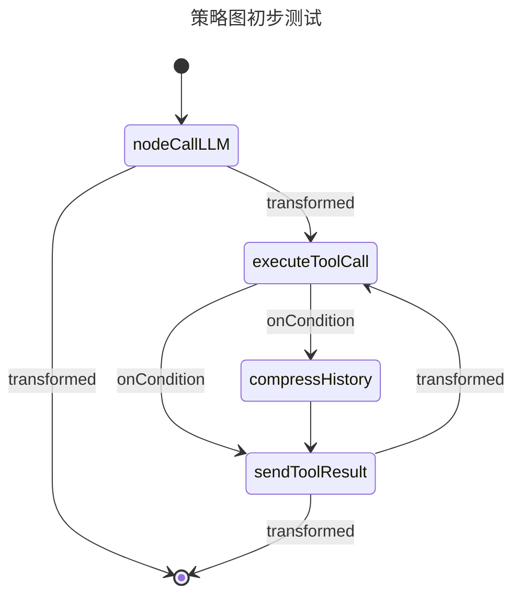

```mermaid
---
title: 策略图初步测试
---
stateDiagram
    state "nodeCallLLM" as nodeCallLLM
    state "executeToolCall" as executeToolCall
    state "compressHistory" as compressHistory
    state "sendToolResult" as sendToolResult

    [*] --> nodeCallLLM
    nodeCallLLM --> executeToolCall : transformed
    nodeCallLLM --> [*] : transformed
    executeToolCall --> compressHistory : onCondition
    executeToolCall --> sendToolResult : onCondition
    compressHistory --> sendToolResult
    sendToolResult --> executeToolCall : transformed
    sendToolResult --> [*] : transformed
```